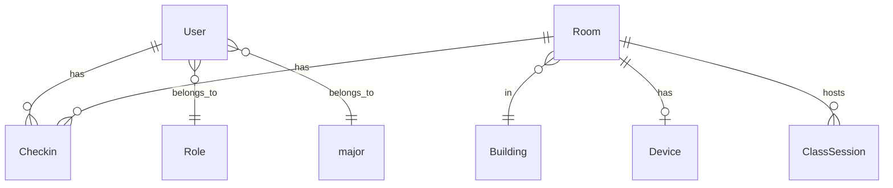

# 🏗️ System Architecture & Schema

## สถาปัตยกรรมโดยรวม

```
Frontend (React / Next.js / etc.)
   │
   │  HTTP Request + Session Cookie (connect.sid)
   ▼
Express Server (port 3000)
   ├── /api/auth/*       → Auth Controller
   ├── /api/qrcode/*     → QR Code Controller
   ├── /api/users/*      → Users Controller
   ├── /api/rooms/*      → Rooms Controller
   └── /api/dashboard    → Dashboard Controller
   │
   ├── Redis (ioredis)         ← เก็บ Session Data
   └── PostgreSQL (Prisma ORM) ← ข้อมูลหลักทั้งหมด
```

## 🔐 Auth Flow (Login)
1. Frontend ส่ง `POST /api/auth/login`
2. Backend ตรวจสอบข้อมูลใน PostgreSQL
3. หากสำเร็จ สร้าง Session ใน Redis และส่ง `Set-Cookie` กลับไป
4. Browser จะแนบ Cookie อัตโนมัติใน Request ถัดไป

## 📷 QR Code Check-in Flow
1. **Booth**: ขอ Token (`/generate`) -> ได้ `scan_url` มาแสดง
2. **นักศึกษา**: สแกน `scan_url` -> ระบบตรวจสถานะ (`/scan`) -> กดยืนยัน (`/action`)
3. **Booth**: Polling (`/poll`) ตรวจว่ามีคนใช้ Token หรือยัง -> ถ้าใช้แล้วสร้างใหม่

## 🗄️ Database Schema (Prisma)

### Entity Relationship


### Models
| Model | คำอธิบาย |
|-------|----------|
| `User` | ผู้ใช้นักศึกษา/แอดมิน |
| `Room` | ห้องเรียน/สถานที่ |
| `Device` | อุปกรณ์ IoT ประจำห้อง |
| `Checkin` | บันทึกการเข้า-ออก |
| `AuditLog` | ประวัติการใช้งานระบบ |

## 💻 วิธีเรียก API จาก Frontend

### ติดตั้ง Axios
```bash
npm install axios
```

### ตั้งค่า Axios Instance
```ts
import axios from 'axios';

const api = axios.create({
  baseURL: 'http://localhost:3000/api',
  withCredentials: true,  // ⚠️ สำคัญมากสำหรับ Session
});

export default api;
```
